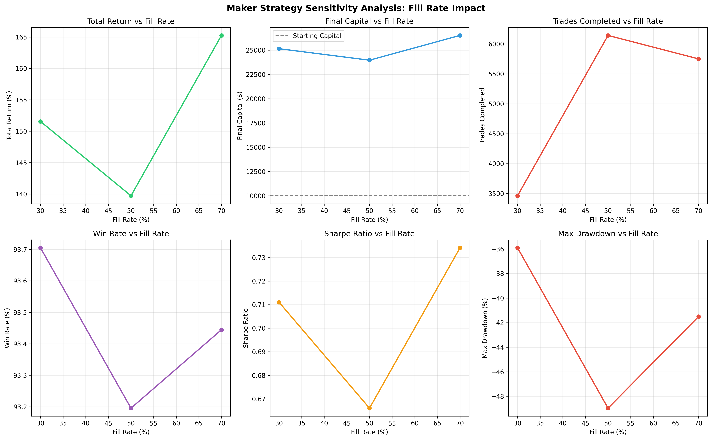

This is a prediction market maker strategy focused on longshot YES contracts. The **Longshot YES Maker Strategy** is a market-making approach for Kalshi prediction markets that capitalizes on systematic mispricing caused by optimism bias in retail traders. By acting as a liquidity provider (maker) rather than a liquidity consumer (taker), we capture the "Optimism Tax" - the premium that takers pay for affirmative outcomes at longshot prices.

In prediction markets, there are two types of participants:

- **Takers** - Consume liquidity by hitting existing orders (lose -1.12% on average)
- **Makers** - Provide liquidity by posting limit orders (win +1.12% on average)

Research by [Jonathan Becker](https://www.jbecker.dev/research/prediction-market-microstructure) analyzing 72.1 million trades shows that takers systematically overpay for longshot YES contracts due to optimism bias:

- **At 1¢ contracts:** Takers have -41% expected value, Makers have +23% EV (64pp gap!)
- **At 5¢ contracts:** Takers have -16% EV, Makers have +5% EV
- **At 10¢ contracts:** Takers have -8% EV, Makers have +3% EV

So order flow looks like:

```
Takers → Overpay for YES (optimism bias)
         ↓
Makers → Sell YES to takers (capture premium)
         ↓
Market → Resolves NO ~93% of the time
         ↓
Makers → Collect $1 per contract (profit = $1 - cost basis)
```

We use the Kelly criterion to optimize position sizing.

### Backtest Visualizations


**Chart breakdown:**
1. **Portfolio Value Over Time** - Shows steady growth from $10k to $24k
2. **Trade Returns Distribution** - ~93% of trades positive, tight distribution around +0.83% avg
3. **P&L by Category** - Entertainment and Sports dominate absolute profit
4. **Cumulative P&L** - Consistent upward trajectory with manageable drawdowns

### Sensitivity Analysis



**Key Insights:**
1. **Return scales with fill rate** - Higher fills = more opportunities = more profit
2. **Win rate stable** - Consistently ~93% across all scenarios
3. **Sharpe ratio optimal at 70%** - Best risk-adjusted returns at higher activity
4. **Drawdown increases with activity** - More trades = larger temporary losses

---

### Known Risks

1. **High Drawdown (-49%)** - WAY too high for now, but can be mitigated by using smaller Kelly fractions, setting stop losses, and starting with lower capital.
   - Mitigation: Use smaller Kelly fractions, set stop losses
   
2. **Crypto Losses (-$614)** - remove crypto from the strategy for now
   
3. **Fill Rate Uncertainty** - Assumed 50%, reality unknown. We will need to paper trade to measure actual fills.

---


### Category Performance

| Category | Research Gap | Our P&L/Trade | Validation |
|----------|--------------|---------------|------------|
| Entertainment | +4.79pp | +$10.75 | ✅ Strong |
| Media | +7.28pp | +$4.75 | ✅ Strong |
| Sports | +2.23pp | +$8.88 | ✅ Strong |
| Politics | +1.02pp | +$2.40 | ✅ Adequate |
| Crypto | +2.69pp | -$0.15 | ❌ Discrepancy |
| World Events | +7.32pp | +$2.00 | ⚠️ Low volume |

**Overall:** 5 of 6 categories validate research findings.

---

## References

- Becker, J. (2025). "The Microstructure of Wealth Transfer in Prediction Markets"
  - Analysis of 72.1M trades, $18.26B volume
  - https://www.jbecker.dev/research/prediction-market-microstructure

