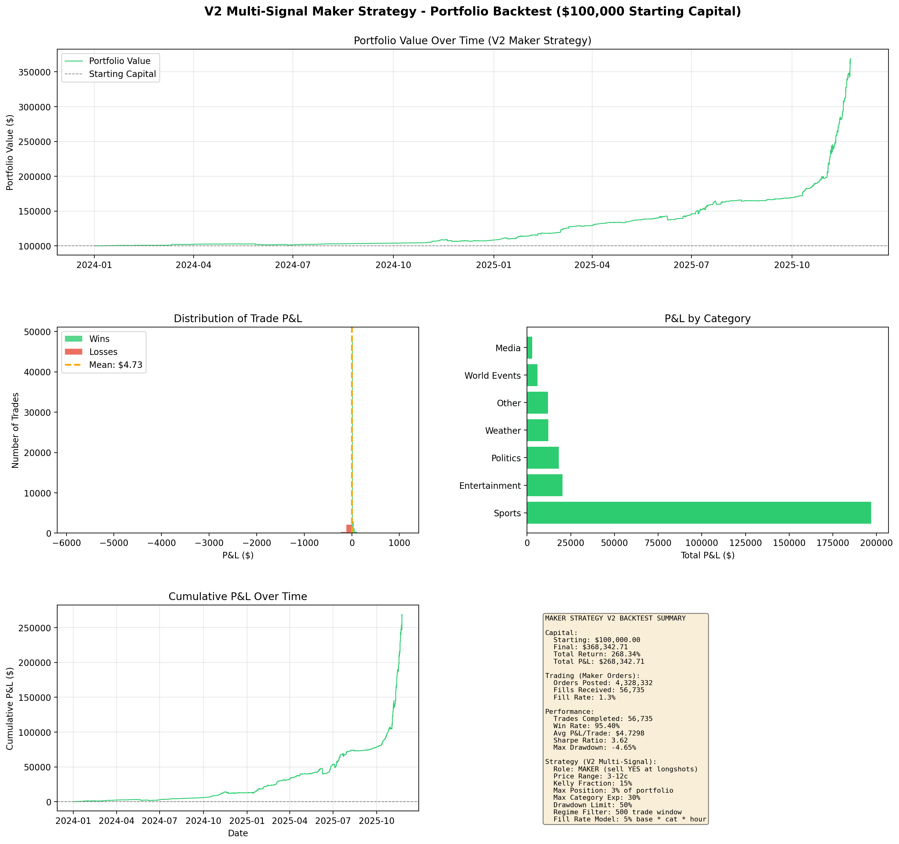

# Prediction Market Maker Strategy

A maker-side strategy for Kalshi prediction markets that exploits favorite-longshot bias. Sell YES contracts at longshot prices (3-12¢) and profit when markets resolve NO.

Built on analysis of 72M+ Kalshi trades (2021-2025). Maker edge only emerged post-2024 as retail volume increased.

## Backtest Results

$10,000 starting capital, Jan 2024 - Nov 2025:

| Metric | Value |
|--------|-------|
| Final Capital | $39,789 |
| Total Return | 298% |
| Win Rate | 95.2% |
| Sharpe Ratio | 3.09 |
| Max Drawdown | 12.8% |
| Trades | 41,304 |

## How It Works

1. **Post limit orders** selling YES on longshot contracts (3-12¢)
2. **Filter by signal** — category edge, time-of-day, and rolling regime detection
3. **Size with Kelly criterion** (15% fraction) with per-category exposure caps (30%)
4. **Collateral locks** until market resolution — the backtester models this realistically

### Filters

- **Price**: 3-12¢ (sweet spot for maker excess return)
- **Category**: Weighted by historical maker-taker gap; Finance, Crypto, Esports excluded
- **Time-of-day**: Evening hours (16-23 ET) get 1.3x weight — retail bias is strongest
- **Regime**: Rolling 500-trade window must show positive maker excess

## Backtest Methodology

The backtester uses a collateral-aware model — capital is locked at entry and released at market resolution via a min-heap scheduler. Includes Kalshi maker fees (`ceil(0.0175 × C × P × (1-P))`).

### Known Assumptions

- **Fill rate is modeled (5% base)**, not observed — actual fills depend on market depth and competition
- **Category weights have lookahead** — derived from the same dataset used for backtesting
- **Resolution is known at trade time** — fills are random, but we don't model mark-to-market P&L during holding

### Bugs Found and Fixed

Initial backtest showed $10K → $2.15M (877x capital overstatement). Three bugs were identified and fixed:

1. **Instant resolution** — trades resolved immediately, recycling capital infinitely. Fixed by tracking collateral lockup until market close.
2. **Category exposure no-op** — the 30% category cap never triggered due to a assignment bug. Fixed by tracking actual locked collateral.
3. **Sharpe inflation** — zero-P&L days were dropped, inflating Sharpe ~30%. Fixed by including all calendar days.
